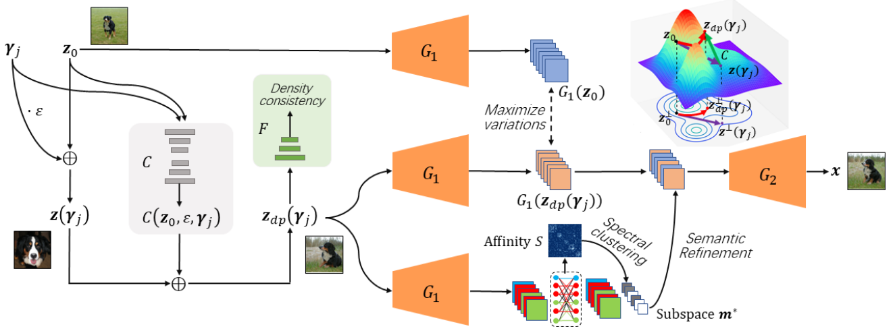

# DP-LaSE
Implementation for the paper *Discovering Density-Preserving Latent Space Walks in GANs for Semantic Image Transformations* published in ACM Multimedia, 2021. For more details, please refer to my [personal website](guanyueli.com/https://guanyueli.com/publication/multimedia2021) or read the [PDF](https://1drv.ms/b/s!AqN-jN9xngyFohsv5_4BvANJPMcG). 

<center>
    
    <br>
    <div style="color:orange;
    display: inline-block;
    color: black;
    padding: 2px;">
    Teaser: The flowchart of the DP-LaSE. 
    </div>
</center>

# Environment
I provide the conda environment in file *conda_env.yaml* if you are interested. 
```
conda env create -f conda_env.yaml
```

# Run the Code
All the relavant code is released, but they are quit messy right now. I will edit them after this tough PhD application cycle. 

# Some Results
I demonstrate some directions in BigGAN and StyleGAN. For dog in BigGAN, we mainly found some directions that cause position change, like left-right, zoom in-out and up-down. For human face in StyleGAN, various directions are found. If the intermediate layer we set to optimize the maximum variation is close to the input, the attribution we found are age, gender, etc. Otherwise, attributes like glasses and bear can be found. 
<table>
    <tr>
        <td>
            <center>
            
            <br>
            <div style="color:orange;
            display: inline-block;
            color: black;
            padding: 2px;">
            (a) Left-right
            </div>
            </center>
        </td>
        <td>
            <center>
            
            <br>
            <div style="color:orange;
            display: inline-block;
            color: black;
            padding: 2px;">
            (b) Zoom in - out
            </div>
            </center>
        </td>
        <td>
            <center>
            
            <br>
            <div style="color:orange;
            display: inline-block;
            color: black;
            padding: 2px;">
            (c) Up - down
            </div>
            </center>
        </td>
    </tr>
</table>
<center>
<div style="color:orange;
    display: inline-block;
    color: black;
    padding: 2px;">
    Figure 3. Some of the directions in BigGAN. 
    </div>
</center>

<table>
    <tr>
        <td>
            <center>
            
            <br>
            <div style="color:orange;
            display: inline-block;
            color: black;
            padding: 2px;">
            (a) Bear
            </div>
            </center>
        </td>
        <td>
            <center>
            
            <br>
            <div style="color:orange;
            display: inline-block;
            color: black;
            padding: 2px;">
            (b) Hair
            </div>
            </center>
        </td>
        <td>
            <center>
            
            <br>
            <div style="color:orange;
            display: inline-block;
            color: black;
            padding: 2px;">
            (d) Gender
            </div>
            </center>
        </td>
        <td>
            <center>
            
            <br>
            <div style="color:orange;
            display: inline-block;
            color: black;
            padding: 2px;">
            (c) Glasses
            </div>
            </center>
        </td>
    </tr>
</table>
<center>
<div style="color:orange;
    display: inline-block;
    color: black;
    padding: 2px;">
    Figure 1. Some of the directions in PGGAN. 
    </div>
</center>